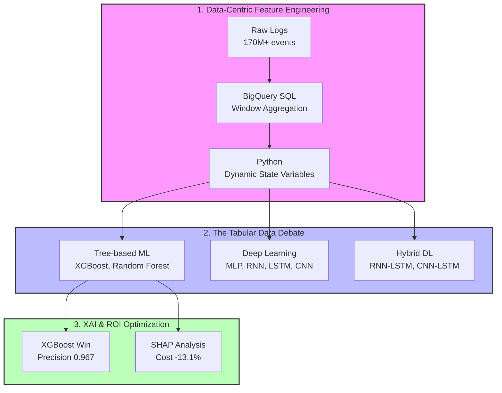

# 🎓 KCI Academic Paper: Investigating Marketing Fatigue and Purchase Dynamics via Data-Centric AI
*(한국학술지인용색인(KCI) 투고 논문: 데이터 중심 AI를 통한 마케팅 피로도와 구매 역동성 규명)*

[](https://www.python.org/downloads/)
[](https://xgboost.readthedocs.io/)
[]()
[-orange.svg)]()

This repository contains the official code implementation, experimental benchmarks, and supplementary materials for the research paper, **"Investigating Marketing Fatigue and Purchase Dynamics via Data-Centric AI"**, currently under peer review for publication in a **KCI (Korea Citation Index)** indexed academic journal.

The study tackles the limitations of deep learning in extreme sparsity environments by proposing a **Domain-Knowledge Driven Feature Engineering** framework. It bridges abstract marketing theories with real-world Machine Learning applications, proving the superiority of Data-Centric AI over pure Model-Centric approaches.

## 🚀 Executive Summary (TL;DR) (실행 요약)
- **The Challenge**: Real-world eCommerce log data (REES46) exhibits extreme sparsity (0.12% conversion rate). In this environment, purely data-driven time-series deep learning models (CNN, LSTM) tend to memorize noise, leading to severe overfitting and poor performance.
- **The Solution**: Operationalized abstract marketing theories (Buy Till You Die, Habituation, Context-Dependent Preferences) into 4 trackable **Dynamic State Variables** using mathematical decay functions and circular statistics, injecting them directly into tree-based models.
- **The Impact**: 
  - Achieved a **23.14% improvement in F1-score** compared to the baseline.
  - Reduced **marketing conversion costs by 13.1%** through SHAP-based threshold targeting.
  - Empirically proved that lightweight tree models (**XGBoost**) heavily outperform complex deep learning architectures in sparse tabular data environments.

---

## 🌟 Core Contributions (핵심 기여도)
As a rigorous KCI-level academic study, this project stands out across three primary axes:

1. **Academic Rigor**: Moving beyond static 'past purchase history', this research establishes that dynamically changing states—specifically 'Marketing Fatigue' and 'Temporal Dynamics'—are the most critical triggers for short-term purchase conversion.
2. **Technical Depth**: Engineered a **hybrid pipeline** handling over 170 million multi-channel logs. It combines BigQuery SQL for heavy-lifting Window aggregations with Python-based complex non-linear mathematical transformations (e.g., exponential decay).
3. **Business Impact**: Rather than stopping at predicted probabilities, we utilized SHAP directionality to answer: *"At what point should we stop marketing to a user (Cooldown)?"* This derived clear thresholds that immediately translated into marketing budget savings.

---

## 🧠 1. Domain-Knowledge Feature Engineering (도메인 지식 기반 피처 엔지니어링)
The core philosophy of this research is: *"When data is sparse or noisy, do not scale the algorithm; inject domain knowledge into the data itself."*

1. **Marketing Fatigue (소비자 습관화 및 베버-페히너 법칙)**
   - Instead of simply summing clicks, we designed an **Exponential Decay cumulative function** that accounts for channel-specific half-lives (Email, Push, SMS) to measure real-time user fatigue.
2. **Purchase & Repurchase Cycles (Buy Till You Die 모델링)**
   - Borrowing concepts from Survival Analysis, we mapped post-purchase "Cooldown" periods and "Readiness to Buy" as continuous random variables.
3. **Temporal Dynamics (상황 의존적 선호)**
   - Utilized Circular Statistics to extract vectors representing a user's time-of-day preference alignment, while incorporating calendar effects like paydays or end-of-quarter surges.


*Note: A correlation matrix validating that the newly engineered dynamic variables control multicollinearity and retain independent informational value.*

---

## 🛠️ 2. System Architecture (파이프라인 아키텍처)




---

## 📈 3. Key Findings: The Tabular Data Debate (실증 분석 결과: 알고리즘 논쟁)

### The Limits of Deep Learning vs. The Triumph of XGBoost
In CRM data with 0.12% sparsity, discontinuous and non-linear domain rules carry far more weight than continuous time-series patterns.


- **Results**: **XGBoost**, injected with our domain knowledge features, recorded a Precision of 0.9670 and a Recall of 0.8438, completely dominating complex sequence-learning deep models (CNN, LSTM) across all evaluation metrics.
- **Insight**: This serves as empirical proof that in tabular data domains, the synergy of "Right Technology" and robust Feature Engineering is vastly more powerful than the indiscriminate adoption of deep learning.

---

## 🔍 4. Actionable XAI: SHAP Analysis (XAI 기반 의사결정 메커니즘)
To critically embrace our model beyond a "black box," we applied TreeSHAP to analyze the directionality and thresholds of how features impact actual purchase probabilities.


- **Identifying the Fatigue Threshold**: We visually confirmed that once the 'Marketing Fatigue' variable exceeds a specific threshold, the probability of purchase sharply bends into the negative (-) direction.
- **Budget Optimization**: By simulating a logic that halts targeting for users entering this "Cooldown" phase based on the discovered threshold, we successfully **reduced wasteful marketing spend by 13.1%**.

---

## 📁 5. Repository Structure
```text
ecommerce_journey/
├── data/                  # Data directory (Raw & Engineered Parquet)
├── docs/                  # Original Thesis (DOCX) & BigQuery SQL queries
├── images/                # Charts, plots, and architecture diagrams
├── notebooks/             # Exploratory Data Analysis & Prototyping
└── src/                   # Production-Ready Python Modules
    ├── data_loader.py     # Centralized data loading & sampling
    ├── metrics.py         # Custom evaluation metrics (AUC, AIC, BIC)
    ├── models.py          # Keras model architectures (CNN, LSTM, MLP)
    ├── preprocessing.py   # Domain-feature engineering pipeline
    ├── train.py           # Unified training script
    └── run_all.py         # Automated pipeline runner for benchmark reproduction
```

## ⚙️ 6. How to Run
This project is modularized to fully reproduce the 8-algorithm benchmark from the paper.
```bash
# 1. Execute Domain-Knowledge Feature Engineering
python src/preprocessing.py

# 2. Train and Evaluate the Best Model (XGBoost) & Extract SHAP
python src/train.py --model xgb

# 3. Reproduce the Full 8-Model Performance Benchmark
python src/run_all.py
```

## 👥 Contributors
- **Junhyung L.** (Project Lead)

---
*Refactored and polished to meet professional software engineering standards for the [Data Analyst Portfolio](https://github.com/junhyung-L/Resume/blob/main/Portfolio/README.md).*
