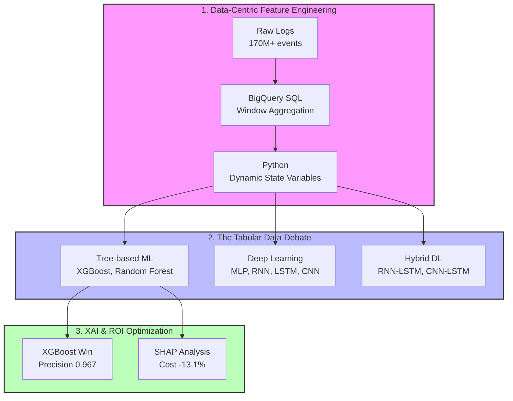
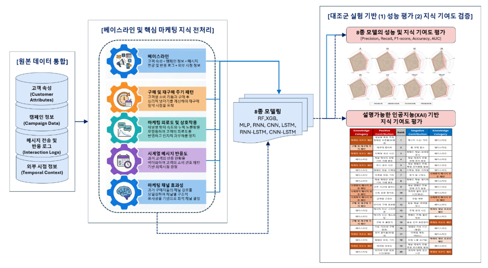
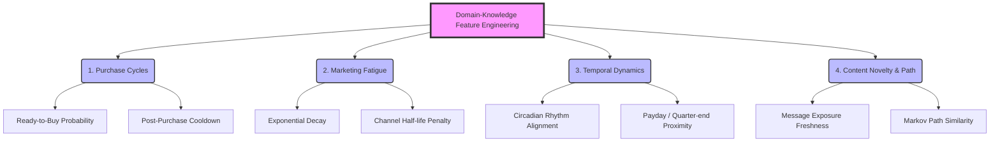
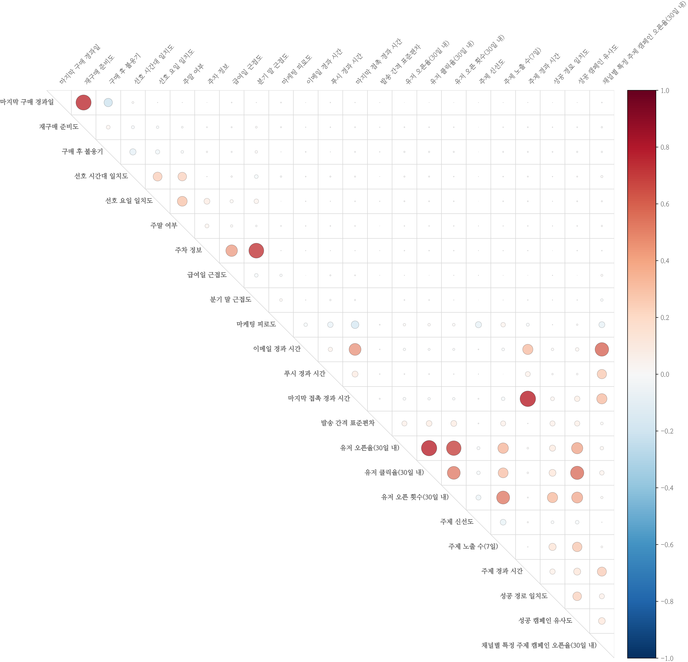
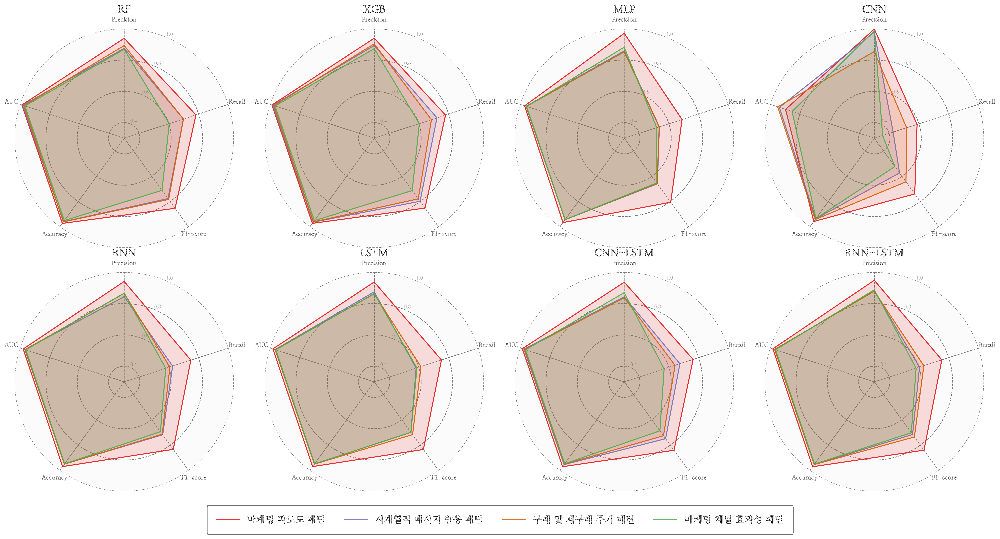
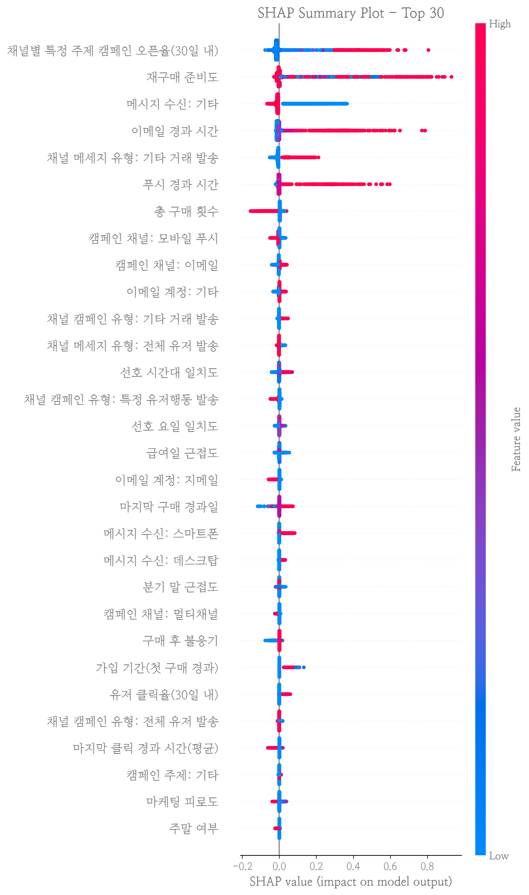
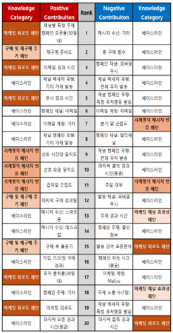

# 🎓 KCI Academic Paper: Investigating Marketing Fatigue and Purchase Dynamics via Data-Centric AI
*(한국학술지인용색인(KCI) 투고 논문: 데이터 중심 AI를 통한 마케팅 피로도와 구매 역동성 규명)*

[](https://www.python.org/downloads/)
[](https://cloud.google.com/bigquery)
[](https://www.tensorflow.org/)
[](https://scikit-learn.org/)
[]()
[-orange.svg)]()

This repository contains the official code implementation, experimental benchmarks, and supplementary materials for the research paper, **"Investigating Marketing Fatigue and Purchase Dynamics via Data-Centric AI"**, currently under peer review for publication in a **KCI (Korea Citation Index)** indexed academic journal.

The study tackles the limitations of deep learning in extreme sparsity environments by proposing a **Domain-Knowledge Driven Feature Engineering** framework. It bridges abstract marketing theories with real-world Machine Learning applications, proving the superiority of Data-Centric AI over pure Model-Centric approaches.

## 🚀 Executive Summary (TL;DR)
- **The Challenge**: Real-world eCommerce log data exhibits extreme sparsity (0.12% conversion rate). In this environment, purely data-driven time-series deep learning models (CNN, LSTM) tend to memorize noise, leading to severe overfitting.
- **The Solution**: Operationalized abstract marketing theories (Buy Till You Die, Habituation, Context-Dependent Preferences) into **Dynamic State Variables** using mathematical decay functions, injecting them directly into machine learning models.
- **The Impact**: 
  - Achieved a **23.14% improvement in F1-score** compared to the baseline.
  - Reduced **marketing conversion costs by 13.1%** through SHAP-based threshold targeting.
  - Empirically proved that lightweight tree models (**XGBoost**) heavily outperform complex deep learning architectures in sparse tabular CRM data.

---

## 📌 1. Problem Definition (문제 정의)
- **Background**: The digital customer journey has evolved into a highly fragmented, non-linear set of touchpoints across multiple channels (Email, Push, SMS). 
- **The Pitfall of Deep Learning**: Current industry trends default to adopting complex deep learning (RNN, LSTM) for sequence modeling. However, CRM data is fundamentally different from image or text data—it is highly discontinuous and extremely sparse.
- **Vision**: To shift from a "Model-Centric" paradigm to a **"Data-Centric"** one by enriching the input space with established marketing domain knowledge, narrowing the algorithm's search space and improving generalization.


*Figure 1: Overall methodology combining Domain-Knowledge injection, Algorithm Benchmarking, and XAI optimization.*

---

## 🛠️ 2. System Architecture (시스템 프레임워크)
This research handles over 170 million raw events from the REES46 eCommerce dataset. To process this scale efficiently, a hybrid BigQuery and Python pipeline was developed.


*Figure 2: Data Pipeline and Modeling Framework from the original academic paper.*

---

## 🧠 3. Domain-Knowledge Feature Engineering (도메인 특성 조작화)
The core philosophy of this research is: *"When data is extremely sparse (0.12%), do not rely solely on the algorithm to find patterns; explicitly inject marketing domain knowledge into the input space."* 



We quantified 4 major marketing theories into dynamic variables to solve the limitations of traditional static CRM models (like basic RFM):

### 1. Purchase & Repurchase Cycles (Buy Till You Die 모델링)
- **Why?**: Traditional RFM models fail to capture the "Cooldown" effect. Behavioral economics dictates that purchase probability drops immediately after a transaction and gradually rises as it approaches the user's natural repurchase cycle.
- **How?**: Borrowing from Survival Analysis, we modeled a **`Ready-to-Buy`** probabilistic density function based on an individual's past purchase intervals, alongside a dynamic **`Cooldown`** penalty variable.

### 2. Marketing Fatigue (광고 마모 효과 및 베버-페히너 법칙)
- **Why?**: Information Processing Theory and the Weber-Fechner Law suggest that repeated, excessive marketing stimuli increase a consumer's sensory threshold, causing fatigue and actually *decreasing* conversion rates.
- **How?**: We engineered an **Exponential Decay (지수 감쇠) cumulative function**. To reflect reality, we assigned different decay half-lives based on channel intrusiveness (`SMS < Push < Email`), tracking the real-time accumulated fatigue of each user.

### 3. Temporal Dynamics (시점 역동성 및 캘린더 효과)
- **Why?**: Consumer preferences are not static. Cognitive receptiveness aligns with circadian rhythms, and purchasing power fluctuates with economic events (e.g., paydays).
- **How?**: Utilized **Circular Statistics (Cosine Distance)** to calculate how closely a message's send time aligns with a user's historical preferred activity time. Added proximity variables for paydays and quarter-ends to capture temporary spikes in disposable income.

### 4. Content Novelty & Path Efficiency (콘텐츠 신규성과 마코프 경로)
- **Why?**: Based on Shannon's Information Entropy, repetitive messages lose value. Furthermore, the modern customer journey is a non-linear Markov process where channel sequence matters.
- **How?**: Quantified the "Freshness" of a message by combining recent exposure frequency with elapsed time. Measured path efficiency by calculating the similarity between a user's current touchpoint sequence and historically successful conversion paths.


*Figure 3: Correlation matrix validating that the engineered dynamic variables retain independent informational value without causing severe multicollinearity (most linear correlations < 0.2).*

---

## 📈 4. Modeling & Evaluation: The Tabular Data Debate
We benchmarked 8 distinct algorithms (XGBoost, RF, MLP, CNN, LSTM, RNN, CNN-LSTM, RNN-LSTM) to test the hypothesis that Tree-based models outperform Deep Learning on sparse tabular data.

### The Triumph of XGBoost
In CRM data with 0.12% sparsity, discontinuous and non-linear domain rules carry far more weight than continuous time-series patterns.


*Figure 4: Radar chart comparing the predictive performance across the 8 evaluated models.*

- **Quantitative Results**: **XGBoost** recorded an overwhelming Precision of **0.9670** and Recall of **0.8438**, outperforming complex sequence-learning models (CNN, LSTM) across all metrics.
- **Academic Insight**: This serves as empirical proof that in tabular data domains, the synergy of "Right Technology" and robust Feature Engineering is vastly more powerful than the indiscriminate adoption of Deep Learning.

---

## 🔍 5. Explainable AI (XAI) & Business Impact
To critically embrace our model beyond a "black box," we applied TreeSHAP to analyze the directionality and thresholds of how features impact actual purchase probabilities.

<div style="display: flex; justify-content: space-around;">
  
  
</div>
<br>
*Figure 5: SHAP Value Summary mapping the top 30 features (Left) and the Feature Directionality analysis identifying specific threshold behaviors (Right).*

### Actionable Marketing ROI
- **Identifying the Fatigue Threshold**: The directionality analysis (Right) visually confirms that once the 'Marketing Fatigue' variable exceeds a specific threshold, the probability of purchase sharply bends into the negative (-) direction.
- **Budget Optimization**: By simulating a business logic that halts targeting for users entering this "Cooldown" phase (based on the discovered threshold), the framework successfully **reduced wasteful marketing spend by 13.1%** while maintaining the exact same number of successful conversions.

---

## 📁 6. Repository Structure
```text
ecommerce_journey/
├── data/                  # Data directory (Raw & Engineered Parquet)
├── docs/                  # Original Thesis (DOCX) & BigQuery SQL queries
├── images/                # Charts, plots, and architecture diagrams
├── notebooks/             # Exploratory Data Analysis & Prototyping
├── Prior research paper/  # Academic references (References.md)
├── results/               # SHAP outputs & Descriptive Statistics
└── src/                   # Production-Ready Python Modules
    ├── data_loader.py     # Centralized data loading & sampling
    ├── metrics.py         # Custom evaluation metrics (AUC, AIC, BIC)
    ├── models.py          # Keras model architectures (CNN, LSTM, MLP)
    ├── preprocessing.py   # Domain-feature engineering pipeline
    ├── train.py           # Unified training script
    └── run_all.py         # Automated pipeline runner for benchmark reproduction
```

## ⚙️ 7. How to Run
This project is modularized to fully reproduce the 8-algorithm benchmark from the paper.
```bash
# 1. Execute Domain-Knowledge Feature Engineering
python src/preprocessing.py

# 2. Train and Evaluate the Best Model (XGBoost) & Extract SHAP
python src/train.py --model xgb

# 3. Reproduce the Full 8-Model Performance Benchmark
python src/run_all.py
```

## 👥 8. Contributors
- **Junhyung L.** (Project Lead)

---
*Refactored and polished to meet professional software engineering standards for the [Data Analyst Portfolio](https://github.com/junhyung-L/Resume/blob/main/Portfolio/README.md).*
